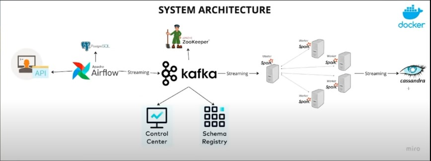
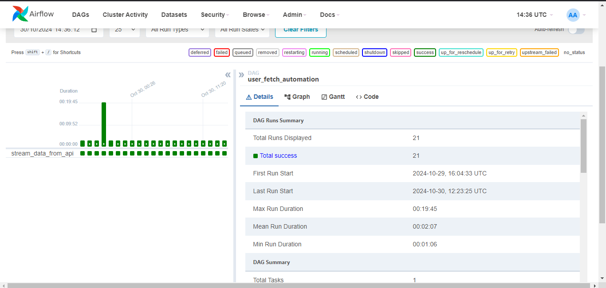
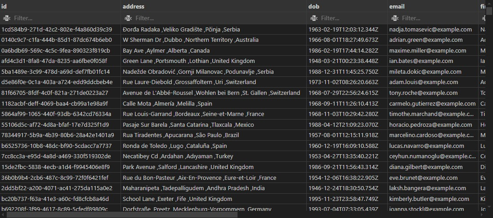
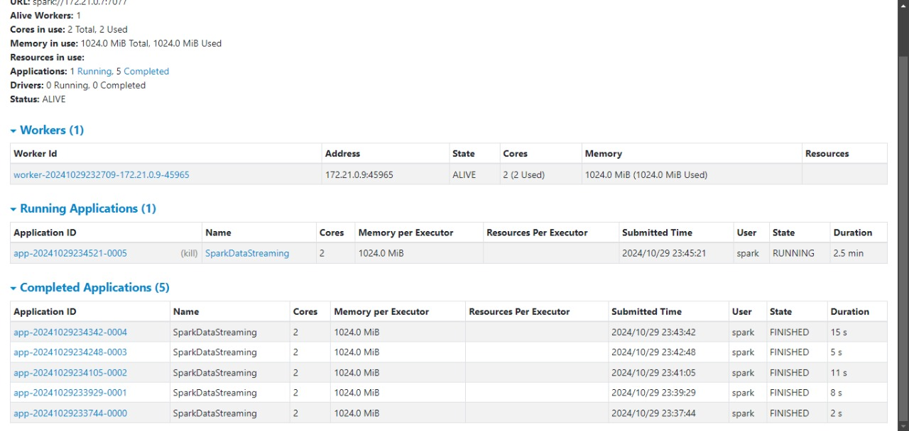
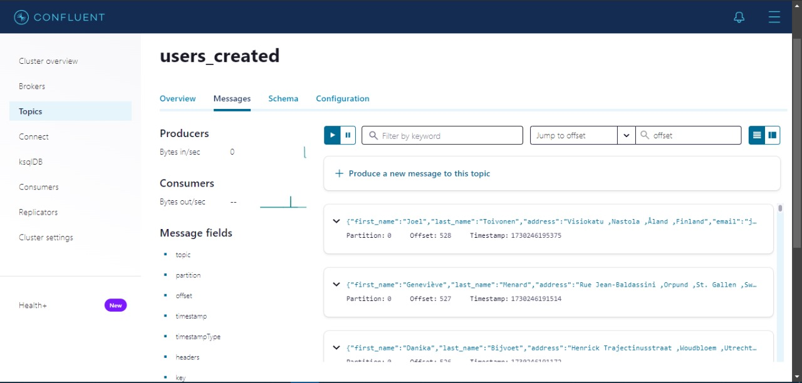
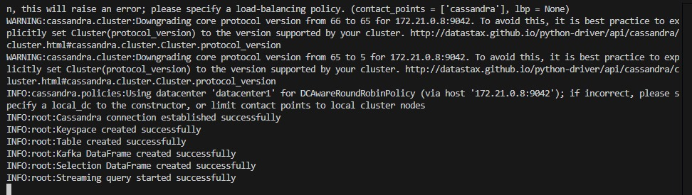

# Data Streaming to Cassandra

## Project Overview
This project demonstrates how to stream data from Kafka to Cassandra using Apache Spark and Docker. It involves creating a Kafka topic, producing messages, and consuming those messages to store them in a Cassandra database.

## Technologies Used
- Apache Kafka
- Apache Spark
- Cassandra
- Docker
- Apache Airflow

## Project Architecture


## Services
The following services are included in this project:
- **Kafka**: Acts as the message broker, facilitating the communication between the producer (fetching data from the API) and the consumer (Spark streaming).
- **Cassandra**: Serves as the NoSQL database where streamed data is stored, enabling quick read and write operations.
- **Spark**: Processes and transforms the streamed data in real time before inserting it into Cassandra.
- **Airflow**: Automates the workflow, managing the fetching of data from the API and the streaming process through an Apache Airflow DAG.



## Running the Project
1. **Clone the repository**:
    ```bash
    git clone <repository-url>
    cd <repository-directory>
    ```

2. **Build and start services using Docker Compose**:
    ```bash
    docker-compose up --build
    ```

3. **Access the services**:
    - Kafka: `localhost:9092`
    - Cassandra: `localhost:9042`
    - Airflow: `localhost:8080` (default username: `admin`, password: `admin`)

4. **Produce messages to Kafka**:
   You can use the Kafka console producer to send messages to the topic `users_created`.

5. **Monitor the streaming**:
   The application will read data from the Kafka topic using the jupyter notebook [spark_stream_cassandra.ipynb] and stream it into the Cassandra table `created_users`.

## Images
- **Data in Cassandra**: 
- **Jobs**: 
- **Message Coming to Topics**: 
- **Streaming to Cassandra**: 

## Conclusion
This project illustrates the integration of Kafka, Spark, and Cassandra for real-time data processing, as well as the orchestration of the workflow using Apache Airflow.
